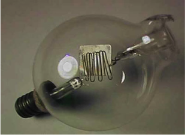
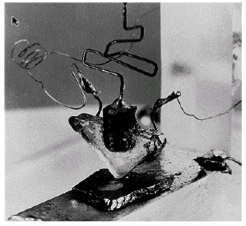
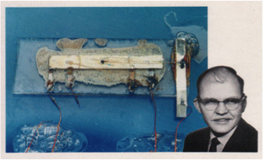
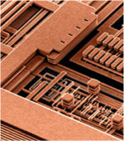

# Introduction and Survey

*Risks and Side Effects and/or Discomforts.* 
A script is a keyword selection. It is characterized by my ideas and prejudices about electronics and circuit design 
strongly but not completely. And as common, this script has been written with a lot of time constraints, hence, it is
not fully proof read and contains errors. Therefore, you should never rely solely on this script. Consult other sources
like books, papers and application notes, also.

## Learning outcomes
The objective of this module is a project course in which students possess a thorough understanding of basic
principles, challenges and limitations in microelectronic circuit design through a design project. After completion of 
this module students ...

* Knowledge and understanding (extension, consolidation and understanding of knowledge)
  * ... have worked in project teams to generate a database that can (potentially) be sent out for fabrication,
  * ... have become familiar with microelectronic circuit design;

* Using, applying and generating knowledge (applying and transferring knowledge, Scientific innovation)
  * ... will have basic intuition by studying a selection of commonly used circuit and design techniques,
  * ... will be prepared for further study of mixed-technology systems; 

* Communication and cooperation
  * ... do circuit development and design in a team,
  * ... decide autonomous about organization and conduct of design steps,
  * ... present progress and results to supervisors and peers,
  * ... assess results from experiments, evaluate and analyze in a team and document scientifically,

* Reflection of academic and professional identity 
  * ... reflect system design and test setup with regard to alternative designs,
  * ... adhere to standards of professional action and documentation. 

## Analysis vs. Design

Unlike common perception, analog circuit analysis and design is not "black magic"
*Circuit analysis.* 
* The art of decomposing a circuit into manageable pieces.
* Based on the simple, but sufficiently accurate models.
  * "Just-in-time" modeling &ndash; Do not use a complex model unless you know why it's needed!

* One circuit $\Rightarrow$ one solution

*Circuit design.* 

* The art of synthesizing circuits based on experience from extensive analysis
* One set of specifications $\Rightarrow$ Many solutions
* Design skills are best acquired through *learning by doing*
  * This is why we'll have a design project.

## Signal Conditioning

*Wikipedia.* 
"In electronics, signal conditioning means manipulating an analog signal in such a way that
it meets the requirements of the next stage for further processing."

"Signal conditioning can include amplification, filtering, converting, range matching, isolation and
any other processes required to make sensor output suitable for processing after conditioning."

## Design Project
*Design and Characterization of an Analog Universal Filter (Biquad).* 

* Basics of filter design
  * Approximation and filter template
  * Biquads 

* Behavioural and macro modelling
  * Filter design
  * Signals and systems analysis

* Circuit design and layout
  * Opamps
  * Integrators
  * Adders

* ASLK Pro and Red Pitaya STEMlab
  * Experiment 4 -- Design of Analog Filters
  * Measurements: Steady State and Frequency Response
  * Simulation with ngspice (KiCAD/Xschem)
  * Data readout and management with Matlab and/or Python
  * Behavioural modelling with Matlab and/or Python

## Scientific Computing

-   [Python (Anaconda)](https://www.anaconda.com/download/)

-   [Matlab (Campus Lizenz)](https://de.mathworks.com/academia/tah-portal/hochschule-bremen-31463273.html)

-   [Command-line tools](https://jeroenjanssens.com/seven/)

## EDA Tools

-   PCB / System Design
    -   [LTspice](https://www.analog.com/en/design-center/design-tools-and-calculators/ltspice-simulator.html)
    -   [KiCad EDA](https://www.kicad.org/)
    -   [Altium Designer](https://www.altium.com/de/altium-designer)
    -   [SiemensEDA PCB tools](https://eda.sw.siemens.com/en-US/pcb/products/)
    -   [cadence System Design & Analysis](https://www.cadence.com/en_US/home/tools/system-design-and-analysis.html)

-   IC / Silicon Design
    -   [IIC-OSIC-TOOLS (open-source)](https://github.com/iic-jku/IIC-OSIC-TOOLS)
    -   [SiemensEDA IC tools](https://eda.sw.siemens.com/en-US/ic/products/)
    -   [cadence IC Design & Verification](https://www.cadence.com/en_US/home/tools/design-excellence.html)
    -   [synopsys silicon design (IC)](https://www.synopsys.com/silicon-design.html)

## OS-Tools

-   [Microsoft-Terminal](https://github.com/microsoft/terminal)

-   [Microsoft-PowerShell](https://learn.microsoft.com/de-de/powershell/scripting/learn/ps101/01-getting-started)

-   [MacOS-Terminal](https://iterm2.com)

-   [Linux/MacOS Shell zsh-tools](https://ohmyz.sh),

-   [git (Versionskontrolle)](https://git-scm.com)

## Code Editors

-   [Visual Studio Code](https://code.visualstudio.com)

-   [Spyder IDE](https://www.spyder-ide.org)

-   [Thonny (Micro-)Python IDE](https://thonny.org)

-   [Emacs](https://www.gnu.org/software/emacs/)

-   [Vim](https://www.vim.org)

## Data Science

-   File system: Files and directories

-   Tabular data: Comma/Tab-Separated-Values (CSV/TSV), Spreadsheet (.xlsx, .ods)

-   Special formats, e.g. MATLAB mat, HDF5

-   Embedded [Databases](https://db-engines.com)

    -   [SQL](https://en.wikipedia.org/wiki/SQL), z.B. [SQlite](https://en.wikipedia.org/wiki/SQLite)
    -   [OLAP](https://en.wikipedia.org/wiki/Online_analytical_processing), z.B. [DuckDB](https://duckdb.org/why_duckdb)

## Publish Computational Content

-   [quarto](https://quarto.org)
    -   [Manuscripts](https://quarto.org/docs/manuscripts/)

-   [Jupyter-Book](https://jupyterbook.org/en/stable/intro.html)

## Are you writing or TeXing?

-   [MikTeX (Windows, MacOS, Linux)](https://miktex.org/)

-   [MacTeX (MacOS)](https://www.tug.org/mactex/)

-   [TeXLive (Linux)](http://tug.org/texlive/)

## LaTeX Editors

-   IDE's
    -   [TeXStudio](http://www.texstudio.org)
    -   [TeXMaker](http://www.xm1math.net/texmaker/)
-   Collaborative Frameworks
    -   [Overleaf, Online LaTeX](https://www.overleaf.com/)
    -   [CoCalc - Online LaTeX](https://cocalc.com/doc/latex-editor.html)

## Bibliography and LaTeX

-   [Citavi im Detail \> Titel exportieren \> Export nach BibTeX](https://www1.citavi.com/sub/manual5/de/exporting_to_bibtex.html)

-   [RefWorks - Library Guide Univ. Melbourne](https://unimelb.libguides.com/c.php?g=565734&p=3912294)

-   [Benutzerdefinierte BibTex-Keys mit Zotero \| nerdpause](https://nerdpause.de/benutzerdefinierte-bibtex-keys-mit-zotero/)

-   [JabRef - Library Guide Univ. Melbourne](https://unimelb.libguides.com/c.php?g=565734&p=3897117)

-   [EndNote - Library Guide Univ. Melbourne](https://unimelb.libguides.com/latexbibtex/endnote)

## Design Project Flow

* Literature research in journals, professional (serious) internet forums (e.g. application notes of semiconductor
  companies) and library
  * Set-up literature database

* Concept of your system
  * Partitioning
  * Functions
  * Work packages

* Design, implementation and validation
  * Mathmatical description
  * SPICE modeling and simulation
  * Data analysis and validation
  * Design report

## Assignments

*Design Project.* 
* **System Modell** Matlab/Python
* **Circuit Design** SPICE
* **Characterisation/Measurement** Red Pitaya
* **Technical/Design Report**

## Course Prerequisites

* Fundamentals of linux operating systems 
* Fundamentals of microelectronics
  * Device physics and models
  * Transistor level analog circuits, elementary gain stages
  * Control theory (requency response, feedback, stability)
  * System theory (Laplace and Z-transform)

* Prior exposure to SPICE, Matlab/Simulink, Python (NumPy, SciPy) or equivalent
* Please talk to me if you are not sure if you have the required background

## Course Topics

* Design of Operational Transconductance Ampilfiers (OTAs)
  * Analysis and design
  * OTAs as integrators
  * Noise analysis

* Continuous time filters
  * Biquad designs
  * Approximation errors
  * Circuit simulation

* Switched capacitor filters
  * Sampling
  * Bilinear transform s-domain to z-domain

## Brave New World

## From Sand to Silicon (Infineon, Dresden)



## Sand to Silicon (GlobalFoundries, Desden)



## FinFET (Intel)



## TSMC Fab (Next Gen 7/5 nm)



## Once upon a time ...

## First IC and today's chips

## Packaging Densities

## Moore's Law



## Why it is worth ...



## Let's go to the beach ...


